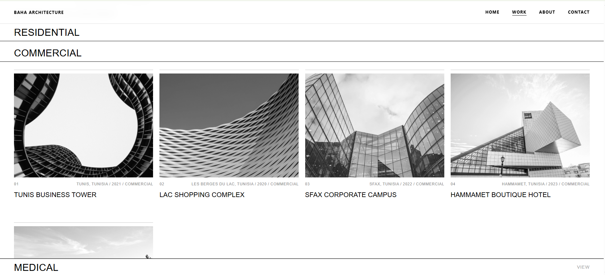
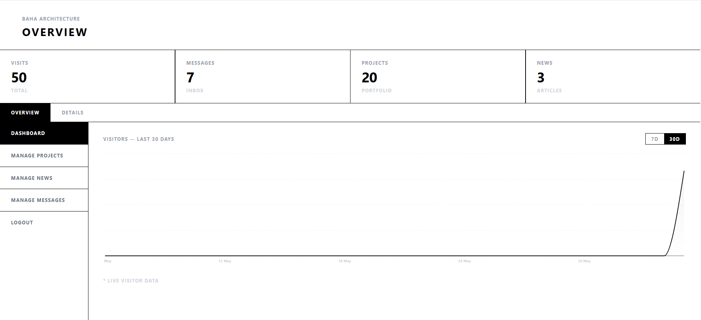
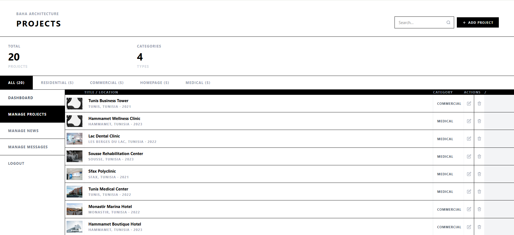

# Baha Architecture — Full Stack Web Application

A professional architecture portfolio and content management system built for Baha Architecture firm. Features a public-facing portfolio site and a secure admin dashboard for managing projects, news, and client messages.

---

## 📸 Screenshots

### Public Site




---------------------------------------------------------------------------------


### Admin Dashboard




---

## 🌐 Live Demo

- **Frontend**: https://baha-architecture.vercel.app
- **Backend**: https://baha-architecture.onrender.com

---

## ✨ Features

### Public Site
- Home page with featured projects
- Projects portfolio with category filtering (Residential, Commercial, Homepage, Medical)
- Individual project pages with image galleries
- News & articles section
- Contact form
- Visitor tracking

### Admin Dashboard
- Secure JWT authentication
- Manage projects (create, edit, delete)
- Image upload directly to Cloudinary
- Manage news articles
- View and manage client messages
- Visitor analytics with charts

---

## 🛠️ Tech Stack

### Frontend
| Technology | Usage |
|------------|-------|
| React 18 | UI framework |
| Vite | Build tool |
| Tailwind CSS | Styling |
| Axios | HTTP requests |
| React Router | Client-side routing |
| Recharts | Analytics charts |

### Backend
| Technology | Usage |
|------------|-------|
| Node.js | Runtime |
| Express.js 5 | Web framework |
| MongoDB | Database |
| Mongoose | ODM |
| JWT | Authentication |
| Passport.js | Auth middleware |
| Cloudinary | Image storage |
| Multer | File upload handling |
| Bcrypt | Password hashing |
| Slugify | URL slug generation |

### Security
| Package | Purpose |
|---------|---------|
| Helmet | Secure HTTP headers |
| CORS | Cross-origin protection |
| express-rate-limit | Brute force protection |
| express-validator | Input validation |

### Infrastructure
| Service | Usage |
|---------|-------|
| Vercel | Frontend hosting |
| Render | Backend hosting |
| MongoDB Atlas | Cloud database |
| Cloudinary | Image CDN |
| UptimeRobot | Server monitoring |

---

## 📁 Project Structure

```
baha-siteweb/
├── client/
│   └── baha-website/
│       ├── src/
│       │   ├── components/
│       │   │   ├── adminfolder/      # Admin dashboard components
│       │   │   ├── About.jsx
│       │   │   ├── Contact.jsx
│       │   │   ├── Home.jsx
│       │   │   ├── Login.jsx
│       │   │   ├── Navbar.jsx
│       │   │   ├── Projectmodal.jsx
│       │   │   └── Work.jsx
│       │   ├── App.jsx
│       │   └── main.jsx
│       ├── vercel.json
│       └── package.json
│
└── server/
    ├── config/
    │   ├── cloudinary.js
    │   └── multer.js
    ├── Controllers/
    │   ├── auth/
    │   ├── news/
    │   └── projects/
    ├── Models/
    │   ├── Admin.js
    │   ├── Message.js
    │   ├── News.js
    │   ├── Projects.js
    │   └── Visitor.js
    ├── Routes/
    │   ├── authRouter.js
    │   ├── newsRouter.js
    │   ├── projectsRouter.js
    │   └── sendmessageRouter.js
    ├── security/
    │   ├── passport.js
    │   └── RoleMiddleware.js
    ├── validators/
    │   ├── loginValidator.js
    │   ├── messageValidator.js
    │   ├── newsValidator.js
    │   └── projectValidator.js
    └── server.js
```

---

## 🚀 Getting Started

### Prerequisites
- Node.js v18+
- MongoDB Atlas account
- Cloudinary account

### Installation

**1. Clone the repository**
```bash
git clone https://github.com/your-username/baha-architecture.git
cd baha-architecture
```

**2. Setup backend**
```bash
cd server
npm install
```

Create `.env` in the server folder:
```env
PORT=3000
MONGO_URI=your_mongodb_atlas_uri
JWT_SECRET=your_jwt_secret
CLOUDINARY_CLOUD_NAME=your_cloud_name
CLOUDINARY_API_KEY=your_api_key
CLOUDINARY_API_SECRET=your_api_secret
CLIENT_URL=http://localhost:5173
NODE_ENV=development
```

```bash
npm run dev
```

**3. Setup frontend**
```bash
cd client/baha-website
npm install
```

Create `.env` in the client folder:
```env
VITE_API_URL=http://localhost:3000
```

```bash
npm run dev
```

---

## 🔐 Security Features

- JWT authentication with expiry
- Role-based access control (admin only)
- Rate limiting on all routes (100 req/15min)
- Stricter rate limiting on login (10 attempts/15min)
- Helmet for secure HTTP headers
- CORS restricted to frontend domain
- Input validation on all endpoints
- File type and size validation (images only, 10MB max)
- Error messages hidden in production

---

## 📦 Deployment

| Service | Configuration |
|---------|--------------|
| Frontend | Vercel — root directory: `client/baha-website`, framework: Vite |
| Backend | Render — root directory: `server`, start command: `node server.js` |
| Database | MongoDB Atlas — free tier M0 |
| Images | Cloudinary — free tier |
| Monitoring | UptimeRobot — pings every 5 minutes |

---

## 👨‍💻 Author

Built by **Khaireddine Ladhari**

---

## 📄 License

This project is private and confidential. All rights reserved © Baha Architecture.
